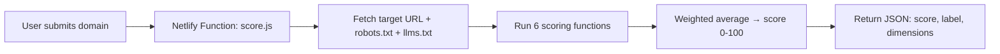

# RankFixer Architecture

> How the live AI Visibility Checker actually works.

---

## Live Architecture

The deployed product is a single **Netlify Function** with zero dependencies:

```
site/netlify/functions/score.js
```



**Key facts:**
- No database — results are ephemeral
- No imports from `platform/`, `rankfixer-mapper/`, or `src/`
- No external APIs — uses Node.js global `fetch`
- Deployed via `netlify.toml` → `site/netlify/functions/`

---

## Scoring Model (Live)

| Signal | Weight | Function | What It Measures |
| :--- | :--- | :--- | :--- |
| Schema | 25% | `scoreSchema()` | JSON-LD `@type` count, specific types (Organization, FAQPage, etc.) |
| Entity | 20% | `scoreEntity()` | `@id` references, `sameAs`, `brand`, Open Graph tags |
| Content | 20% | `scoreContent()` | Word count, FAQ structure, lists/tables, meta description |
| Structure | 15% | `scoreStructure()` | H1/H2 headings, microdata, `<nav>`, `<main>` |
| Crawlable | 10% | `scoreCrawlable()` | HTTP status, robots.txt presence |
| llms.txt | 10% | inline | Presence of `/llms.txt` |

**Score = Σ(signal_score × weight)**

**Labels:**
- 80–100: Strong
- 60–79: Fair
- 40–59: Weak
- 0–39: Poor

---

## What This Repo Contains

| Path | Status | Description |
|---|---|---|
| `site/netlify/functions/score.js` | **Live** | The scoring engine |
| `site/` | Live | Static frontend (checker UI, landing page) |
| `.archive/platform/` | Archived | Earlier platform architecture (never wired) |
| `.archive/rankfixer-mapper/` | Archived | Earlier mapping/audit pipeline (never wired) |
| `.archive/src/` | Archived | Python bridge (never wired) |
| `data/` | Live | Research datasets (top 100 SaaS scores) |
| `GOVERNANCE.md` | Governance | RPES governance thresholds (not yet implemented in live code) |

---

## Archived Code

See `.archive/README.md` for details. The archived code represents an earlier vision for a multi-layer platform with a worker process, engine bridge, and RPES governance. None of it was ever connected to the live Netlify function.

---

## Limits of the Current Model

- **No backlink data** — requires external APIs (Moz, Ahrefs)
- **No brand entity resolution** — requires knowledge graph lookup
- **No Core Web Vitals measurement** — would require Lighthouse or CrUX
- **No citation tracking** — would require monitoring AI engine outputs
- **No content freshness signal** — `scoreContent()` doesn't check `dateModified`

These are intentional scope choices for a free tool. The archived code may be useful if RankFixer ever builds a backend platform.
